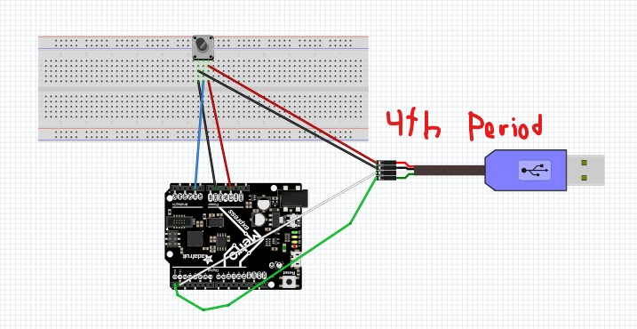
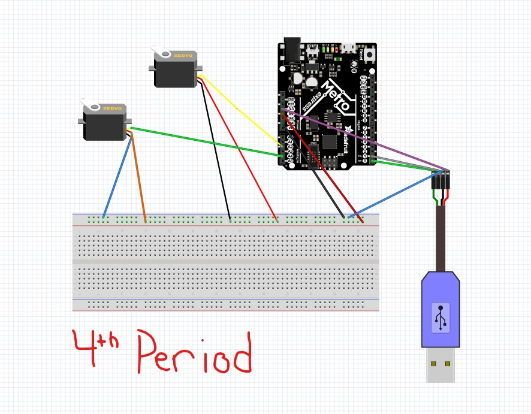

# Expert_Circuitpython
Expert Circuit_Python assignments

### Hello Processing

#### Description

This was a pretty simple project, to use a new programming language, Processing, to show a ball bouncing around a box. I had to make a 300 x 300 box and insert a ball to bounce in it.

#### Lessons Learned

I came into this project without knowing about Processing at all. Luckily since this assignment was relatively easy, I got the hang of it. I noticed the similarities between processing and Arduino, from the setup() and draw() functions. I had tolook up a few things to find out how to make a circle, how to set the size of the screen, and how to have the ball move. I also changed the size of the screen to 300 x 400 because if it was a perfect square, the ball would bounce in the same place everytime.

### Circuitpython to Processing

#### Description

In this assignment, we had to use a potentiometer to send data from Circuitpython to Processing which was then input into a speedometer.

#### Lessons Learned

Before this project, I had never sent data from one language to another, which was difficult, and I also had not used a UART Cable before. I had to use the TX and RX spots on the Metro for the first time, and I also had to code a lot in processing to get the potentiometer mapped out of 180 and to create a speedometer which responded to the potentiometer. I learned during this assignment that the UART Cable should only use 3.3 Volts.

#### Fritzing

### Processing to Circuitpython

#### Description

The purpose of the assignment was to code a user interface which would respond to the mouse and be mapped out of 180. Then you would need to send those mouse inputs to vs code to have 2 servos turn to the designated position of x and y from the mosue. Each servo was given either x or y and it would turn to that position out of 180 where the mouse was.

#### Lessons Learned

This assignment was definetely the hardest of the three and one of the hardest assignments I have worked on throughout the course so far. At first it wasnt very hard, making the GPU wasn't hard, and mapping the mouse movements also wasn't bad. What gave me many problems was trying to send the mapped movements to vs code where it would then be decoded as an integer and the servo would turn. At first I didn't know how to decode it, and then once I figured that out, making it an integer was much harder. I eventually found I had to use my output variable to do output.decode("utf-8") which I implemented in my code. I also had to make some changes to my processing code to send over the bytes as integers.

#### Fritzing

